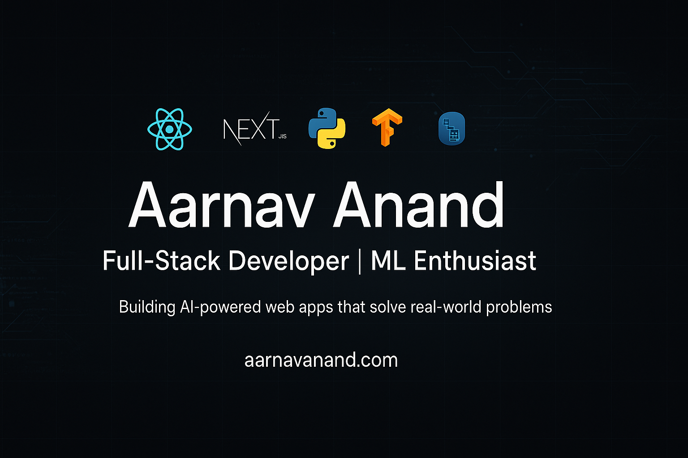

  

### 👋 Hi, I'm Aarnav Anand

Full-stack developer and ML enthusiast passionate about building AI-powered web apps and solving real-world problems with clean, scalable code.

---

### 🛠️ Tech Stack

---

### 🏆 Achievements

- 🥇 **SRM Ideathon Winner (2023):** Built B2B microservice API infra using Node.js & Docker (30% performance gain)  
- 🥈 **Innovate Hackathon Runner-Up (2024):** Developed secure auth system with Next.js & JWT; 99.9% uptime  
- 💻 **Open Source Contributor:** 50+ PRs, maintained 10+ repos (React, JS, Python)  
- 🧑‍🏫 **Technical Mentor:** Trained 20+ juniors in DSA & web dev via hands-on workshops

---

### 📫 Let's Connect

- 🌐 Portfolio: [aarnavanand.com](https://www.aarnavanand.com)
- 📧 Email: [aarnav.anand5@gmail.com](mailto:aarnav.anand5@gmail.com)
- 💼 LinkedIn: [linkedin.com/in/aarnav-anand-aa163728a](https://www.linkedin.com/in/aarnav-anand-aa163728a)
- 🧑‍💻 GitHub: [github.com/Aarnavanand](https://github.com/Aarnavanand)

---

